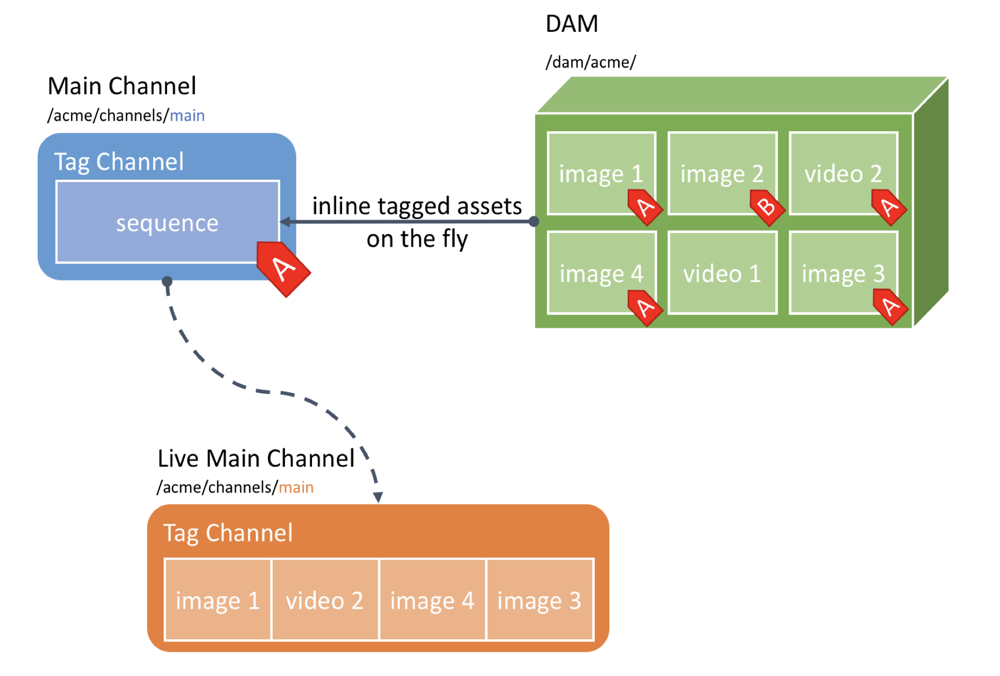

DAM-Driven Authoring Based on Tags
==================================

Use Case
--------

Acme Corp uses Screens to manage its digital signage displays in stores and show the top products of the seasonal collection on the displays. Acme Corp also outsourced all the digital assets handling to a local agency and that agency usually directly uploads its final assets to the DAM where the Acme authors will be able to pick them up for their content. In order to avoid having to manually edit channels whenever a new asset is provided by the design agency, Acme Corp wants to directly play all assets with a given Tag in its channel, effectively bypassing the Screens authoring if possible.

This how-to project walks you through how to achieve this DAM-driven channel authoring using Tagging and a custom _sequence channel_ to automatically inline any asset with a given Tag directly in the channel.

This module contains a sample on how to leverage a custom non-editable _sequence channel_ in order to directly load assets with a given Tag and effectively disabling editing of the sequence. Contrary to the [damdrivenfolder](../damdrivenfolder/) sample, here the asset can have multiple tags and be re-used in multiple channels. The advantage is that you can leverage AEM's well established Tagging feature, re-use existing Tags and organise assets in DAM as you wish. In order to archieve a similar behaviour than the [damdrivenfolder](../damdrivenfolder/) sample, the workflow launcher can be customised to listen only to specific asset folders. A known limitation is that once a _Tag Channel_ has been created the accociated tags cannot be modified anymore.


### Architecture Diagram



How to Use the Sample Content
-----------------------------

* Add more [AEM Tags](http://localhost:4502/aem/tags) (Path: /etc/tags/screens-howto/damdriven-content)
* Tag more assets via [AEM Assets](http://localhost:4502/assets.html/content/dam) (Path: /content/dam/screens-howto/damdriven) 
* Add more tagged channels via [AEM screens-howto -> channels -> dam-driven-content](http://localhost:4502/screens.html/content/screens/screens-howto/channels/dam-driven-content) (Path: /content/screens/channels/dam-driven-content)

---

Technical Details
-----------------

### Compatibility

AEM version|Compatibility           |Comments
-----------|------------------------|--------
6.3        |:white_check_mark:      |
6.4        |:white_check_mark:      |

### Features built upon

The solution uses:
- A _Tag channel_ based on a _sequence channel_
- [Workflow launcher](https://helpx.adobe.com/experience-manager/6-4/sites/administering/using/workflows.html)
- [Workflow model](https://helpx.adobe.com/experience-manager/6-4/sites/developing/using/workflows.html#Model)
- [AEM Tags](https://helpx.adobe.com/experience-manager/6-4/sites/authoring/using/tags.html)

### Manual installation

This module requires HowTo project and is part of the install process. Follow [instructions here](../../README.md).

If you still want to install the module individually, you can run:

```
mvn clean install content-package:install
```

### Manual content setup

1. [Create a screens project](https://helpx.adobe.com/experience-manager/6-4/sites/authoring/using/creating-a-screens-project.html)
0. [Create a new _Tag Channel_](https://helpx.adobe.com/experience-manager/6-4/sites/authoring/using/managing-channels.html#CreatingaNewChannel) and tag the channel
0. Upload an asset and tag it with the same tag


Sample Content Links
--------------------

+ Content
    + [Main Channels](http://localhost:4502/screens.html/content/screens/screens-howto/channels/dam-driven-content)
    + [Assets Folder](http://localhost:4502/assets.html/content/dam/screens-howto/damdriven)

