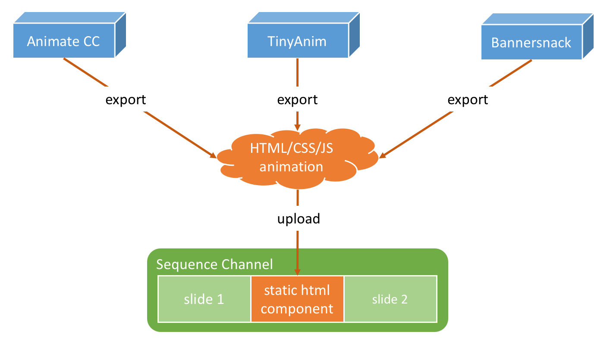

Static Html Component
======================

Security Warning :boom::fire::exclamation::warning:
------------------------------------------------------------------------
>_This use case lets authors upload arbitrary HTML/CSS/JS code to AEM that will be run un-sandboxed at the moment. This is just a proof-of-concept and is not be meant for production environments where malicious code could have severe impact on the system.  
At a minimum, the feature should be limited to a single trusted author using proper ACLs._

Use Case
--------

Acme is a company that uses digital signage screens to advertise its retail products. The designers of the company are used to create complex animations for their advertisement campaigns on their website using Adobe Animate CC and also want to include these animations directly on the digital signage screens.

This how-to project walks you through how to achieve this by exporting the animation to an HTML, CSS and JS files combination and importing them using a custom component in AEM Screens.

The project has a main _sequence channel_ that contains a custom _Static Html Component_ to which we uploaded a zip file containing the Adobe Animate CC HTML/CSS/JS export. A dedicated servlet extracts the content of the zip file and resolves it so it can be played in the channel.

### Architecture Diagram



How to Use the Sample Content
-----------------------------

1. Edit the [Static HTML Content Channel](http://localhost:4502/editor.html/content/screens/screens-howto/channels/import-static-html-content/channel.html)
0. Edit the _Static Html Component_ and upload a zip file with your animation
    - The zip file needs to have an `index.html` file at its root that runs the animation (such as an Adobe Animate CC HTML export)
0. _Preview_ the channel

---

Technical Details
-----------------

### Compatibility

AEM version|Compatibility     |Comments
-----------|------------------|--------
6.3        |:white_check_mark:|
6.4        |:white_check_mark:|

### Features built upon

The solution uses:
- a dedicated servlet that will extract the uploaded zip file and extract the containing HTML/CSS/JS
- a custom _Static Html Component_ that plays the extracted HTML/CSS/JS

### Manual installation

This module requires HowTo project and is part of the install process. Follow [instructions here](../../README.md).

If you still want to install the module individually, you can run:

```
mvn clean install content-package:install
```

### Manual content setup

1. [Create a screens project](https://helpx.adobe.com/experience-manager/6-4/sites/authoring/using/creating-a-screens-project.html)
0. [Create a new _sequence channel_](https://helpx.adobe.com/experience-manager/6-4/sites/authoring/using/managing-channels.html#CreatingaNewChannel) for the master sequence
0. [Edit the channel](https://helpx.adobe.com/experience-manager/6-4/sites/authoring/using/managing-channels.html#WorkingwithChannels) and add a _Static Html Component_
0. Configure the component and upload a zip file with the animation


Sample Content Links
--------------------

+ [Static Html Component](http://localhost:4502/crx/de/index.jsp#/apps/screens-howto/components/screens/content/staticcontent)
+ [Static Html Content Channel](http://localhost:4502/screens.html/content/screens/screens-howto/channels/import-static-html-content/channel)
+ [Location](http://localhost:4502/screens.html/content/screens/screens-howto/locations/import-static-html-content)
    + [Display](http://localhost:4502/screens.html/content/screens/screens-howto/locations/import-static-html-content/import-static-html-content/display)
